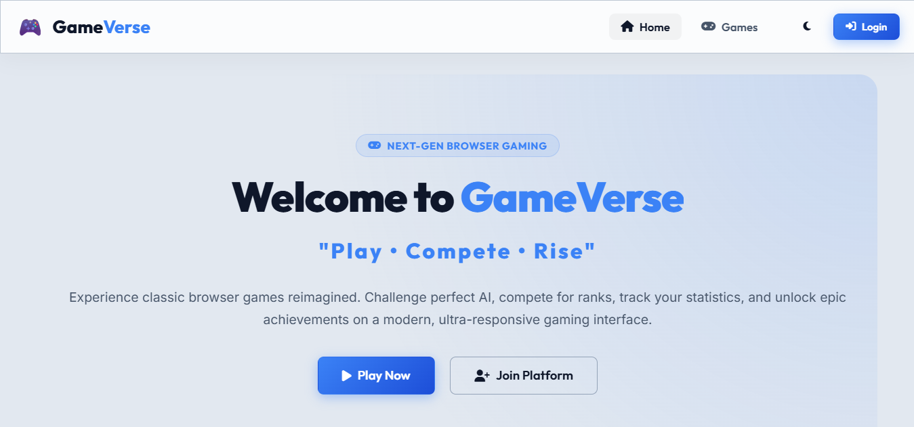
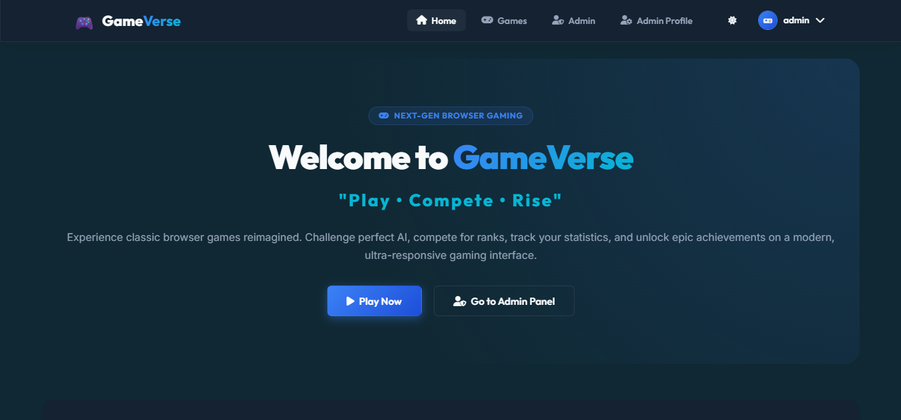
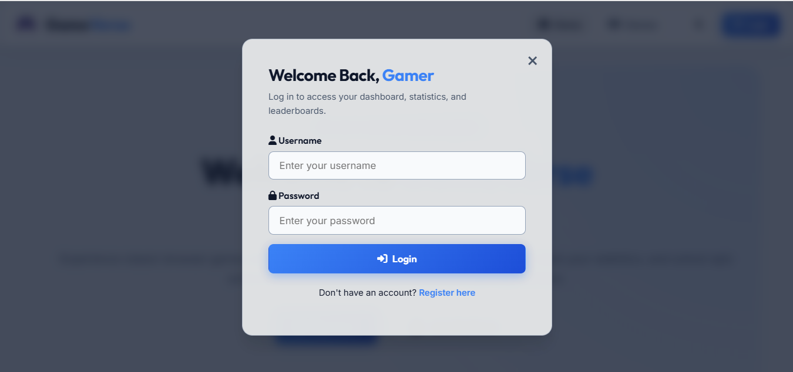
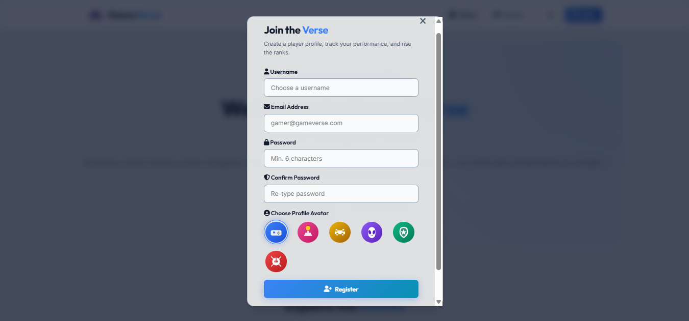
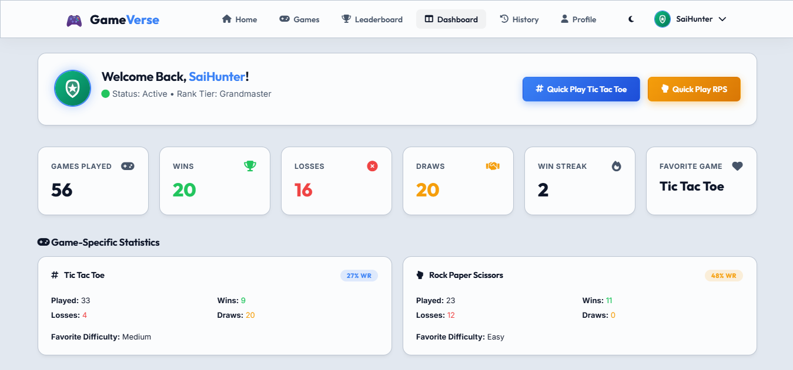
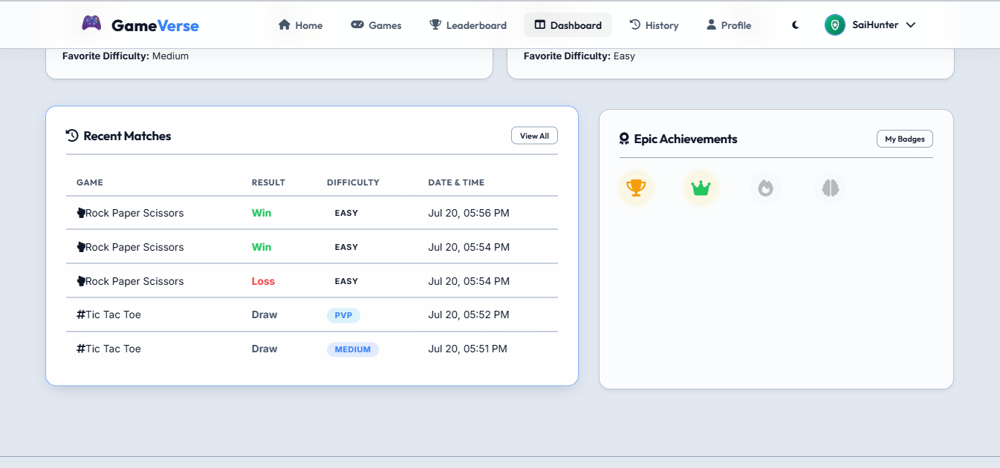
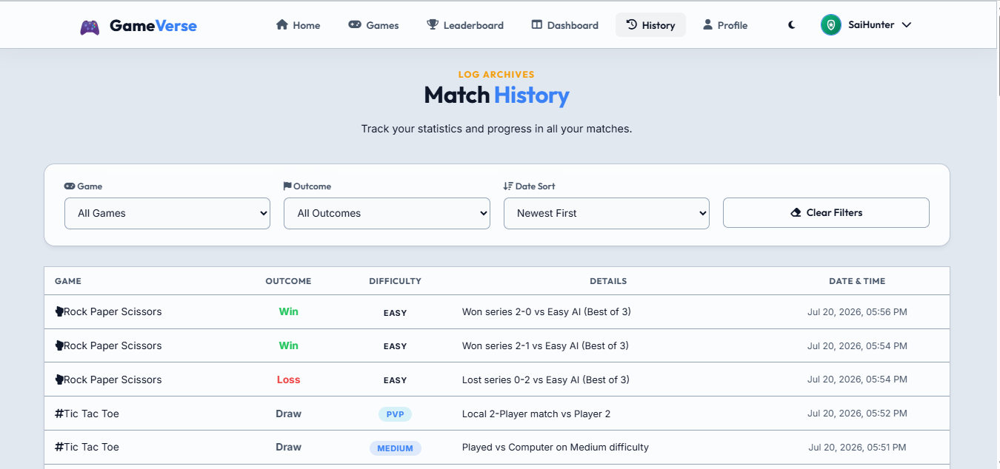
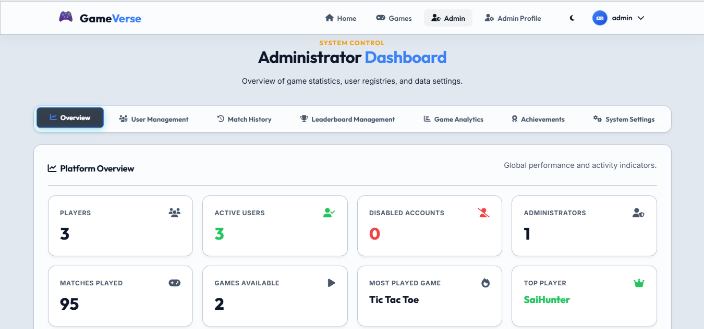
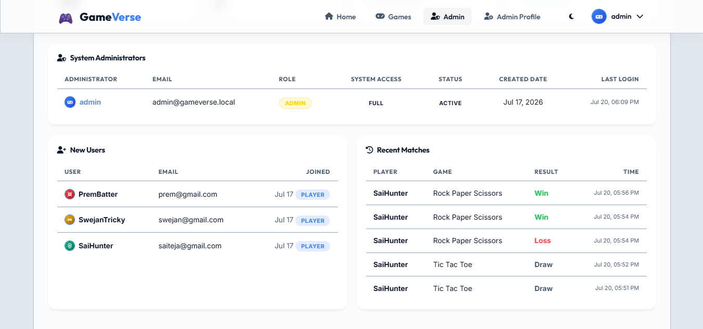
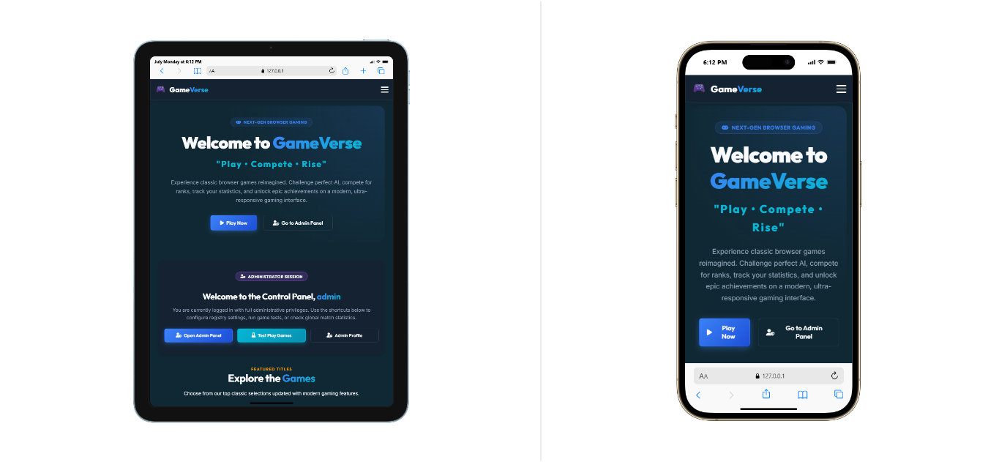

# 🎮 GameVerse

```{=html}
<p align="center">
```
``{=html}
```{=html}
</p>
```
```{=html}
<h1 align="center">
```
🎮 GameVerse
```{=html}
</h1>
```
```{=html}
<p align="center">
```
`<strong>`{=html}A Modern Browser-Based Gaming
Platform`</strong>`{=html}`<br>`{=html} `<em>`{=html}Play • Compete •
Rise`</em>`{=html}
```{=html}
</p>
```


------------------------------------------------------------------------

# 🌐 Live Demo

Replace this with your GitHub Pages URL.

------------------------------------------------------------------------

# 📑 Table of Contents

-   About
-   Features
-   Current Games
-   Screenshots
-   Tech Stack
-   Responsive Design
-   Project Structure
-   Installation
-   How to Play
-   Recent Improvements
-   Roadmap
-   Contributing
-   License
-   Author

------------------------------------------------------------------------

# 📖 About

GameVerse is a modern browser-based gaming platform built with **HTML5,
CSS3 and JavaScript**.

It combines classic browser games with:

-   Authentication
-   User Dashboard
-   Admin Dashboard
-   Leaderboard
-   Achievements
-   Match History
-   Player Statistics
-   Responsive Design
-   Dark Mode
-   Local Storage

The project follows a scalable architecture so additional games can be
added easily.

------------------------------------------------------------------------

# ✨ Features

## 👤 User Features

-   Secure Registration
-   Secure Login
-   Personalized Dashboard
-   User Profile
-   Achievement System
-   Match History
-   Recent Matches
-   Player Statistics
-   Leaderboard
-   Difficulty Tracking
-   Quick Play
-   Dark Theme
-   Mobile Responsive UI
-   Local Storage

## 🛡️ Administrator Features

-   Admin Login
-   Admin Dashboard
-   User Management
-   Leaderboard Management
-   Platform Statistics
-   Game Analytics
-   Achievement Monitoring
-   Match Monitoring

## 🎮 Current Games

  Game                  Status
  --------------------- --------
  Tic Tac Toe           ✅
  Rock Paper Scissors   ✅

More games coming soon.

------------------------------------------------------------------------

# 📸 Screenshots

## 🏠 Home Page



## 🌙 Dark Mode



## 🔐 Login



## 📝 Register



## 👤 User Dashboard



## 🕒 Recent Matches



## 📜 Match History



## 🛡️ Admin Dashboard





## 📱 Responsive Design



------------------------------------------------------------------------

# 🛠️ Tech Stack

  Category          Technology
  ----------------- -----------------------
  Frontend          HTML5
  Styling           CSS3
  Language          JavaScript ES6
  Icons             Font Awesome
  Storage           Browser Local Storage
  Version Control   Git & GitHub
  IDE               Visual Studio Code

------------------------------------------------------------------------

# 📱 Responsive Design

-   Desktop
-   Laptop
-   Tablet
-   Mobile
-   Responsive Navigation
-   Responsive Dashboard
-   Responsive Cards

------------------------------------------------------------------------

# 📂 Project Structure

``` text
GameVerse/
├── assets/
├── css/
├── js/
├── games/
├── index.html
├── README.md
└── LICENSE
```

------------------------------------------------------------------------

# ⚙️ Installation

``` bash
git clone https://github.com/SaiTeja4569/Game_Verse.git
cd Game_Verse
```

Open **index.html** with Live Server or any browser.

------------------------------------------------------------------------

# 🎮 How to Play

1.  Register
2.  Login
3.  Select a game
4.  Play
5.  Unlock achievements
6.  Check leaderboard
7.  View match history

------------------------------------------------------------------------

# 🚀 Recent Improvements

-   Redesigned Dashboard
-   Improved Mobile Responsiveness
-   Responsive Navigation
-   Better Statistics Cards
-   Improved Profile Page
-   Enhanced Achievement System
-   Improved Match History
-   Fixed Mobile Overflow Issue
-   Dashboard UI Enhancements
-   Performance Improvements

------------------------------------------------------------------------

# 🗺️ Roadmap

-   Snake Game
-   Memory Card Game
-   Racing Game
-   Multiplayer
-   Cloud Sync
-   Tournament Mode
-   Friends System
-   AI Difficulty

------------------------------------------------------------------------

# 🤝 Contributing

Contributions are welcome. Fork the repository and submit a pull
request.

------------------------------------------------------------------------

# 📄 License

MIT License.

------------------------------------------------------------------------

# 👨‍💻 Author

**Adepu Saiteja**

GitHub: https://github.com/SaiTeja4569/Game_Verse

------------------------------------------------------------------------

# ⭐ Support

If you like this project, please give it a ⭐ on GitHub.
